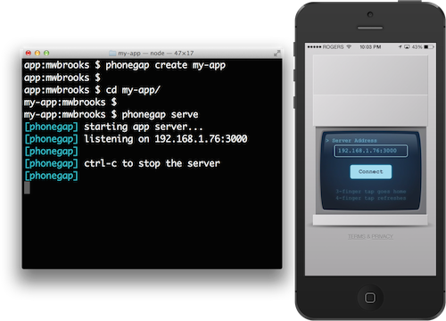

<link href="css/styles.css" rel="stylesheet">
<link href="css/bootstrap.css" rel="stylesheet">

#PhoneGap CLI Quick Start

1. Install the PhoneGap CLI

	`$ sudo npm install -g phonegap`
	
2. Install the PhoneGap Developer App to your mobile devices

	- [iOS](https://itunes.apple.com/app/id843536693)
	- [Android](https://play.google.com/store/apps/details?id=com.adobe.phonegap.app)
	- [Windows Phone](http://www.windowsphone.com/s?appid=5c6a2d1e-4fad-4bf8-aaf7-71380cc84fe3)

3. Create an app from the phonegap CLI

		$ phonegap create myApp
		$ cd myApp/
	
	Or open an existing app project:

		$ cd ~/Development/app/myExistingApp
		
4. Serve your project with the CLI `serve` command

		$ phonegap serve
		[phonegap] starting app server...
		[phonegap] listening on 192.168.1.76:3000
		[phonegap]
		[phonegap] ctrl-c to stop the server
		[phonegap]

	
The CLI starts a tiny web server to serve your project from your computer so the PhoneGap Developer App can connect to it. 

5. Connect to the server IP address from the [PhoneGap Developer App](http://app.phonegap.com) on your mobile device 

	

6. Start coding!

    Now you can freely add, edit, and remove files from your project. Every saved change will automatically update the preview displayed in the PhoneGap Developer App.

  

   
Tip: You can use hidden touch gestures from the PhoneGap Developer app for additional control:
     
          3-finger tap to the home page
          4-finger tap to force the served app to update

