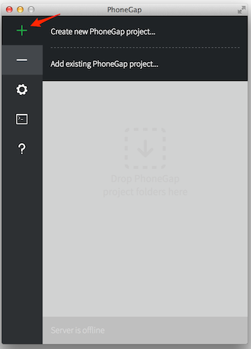
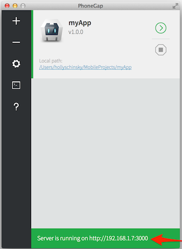

<link href="css/styles.css" rel="stylesheet">
<link href="css/bootstrap.css" rel="stylesheet">

#PhoneGap Desktop App Quick Start

1. Download the [PhoneGap Desktop App](https://github.com/phonegap/phonegap-app-desktop/releases) to your desktop, install, and launch.

2. Click the **+** sign to create a new project or add an existing one to the workspace

	

3. Once the project is created or added you will see it running at a local web server address

	

	
Tip: If you have multiple projects, the one with the green arrow is the current one running. You can click the arrow by another to serve that one instead or stop all of them completely with the button below it. 

3. Install the [PhoneGap Developer App](http://app.phonegap.com) to your mobile devices

	- [iOS](https://itunes.apple.com/app/id843536693)
	- [Android](https://play.google.com/store/apps/details?id=com.adobe.phonegap.app)
	- [Windows Phone](http://www.windowsphone.com/s?appid=5c6a2d1e-4fad-4bf8-aaf7-71380cc84fe3)

4. Connect to your computer from the PhoneGap Developer App to see your new app running from your machine on your mobile device(s).

5. Start coding! Open a text editor and the PhoneGap project you have just created, and begin making changes to the code.

	Every saved change will automatically update the preview displayed in the PhoneGap Developer App.

   
Tip: You can use hidden touch gestures from the PhoneGap Developer app for additional control:
     
          3-finger tap to the home page
          4-finger tap to force the served app to update

     
   
	 
